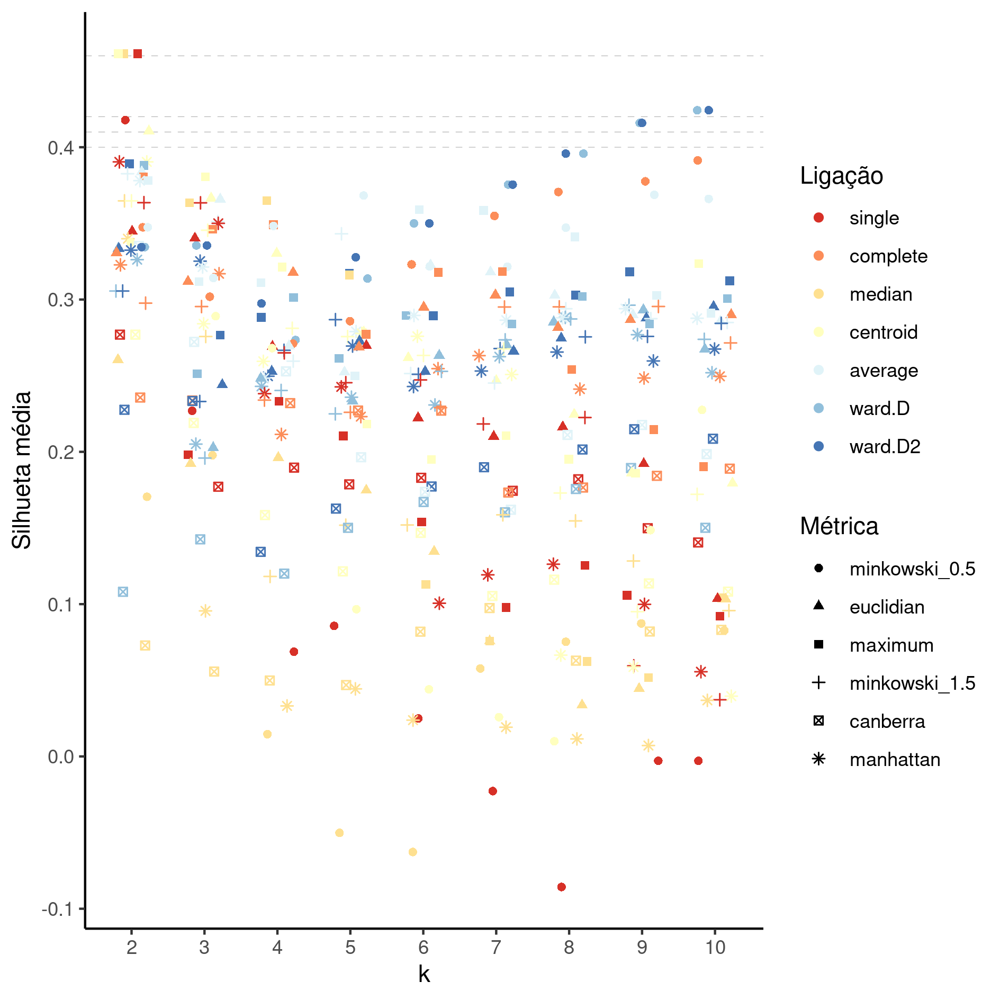
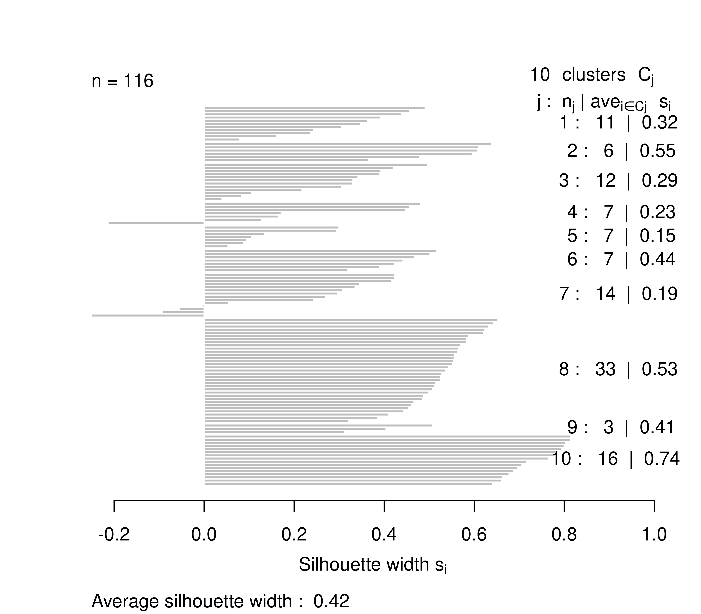
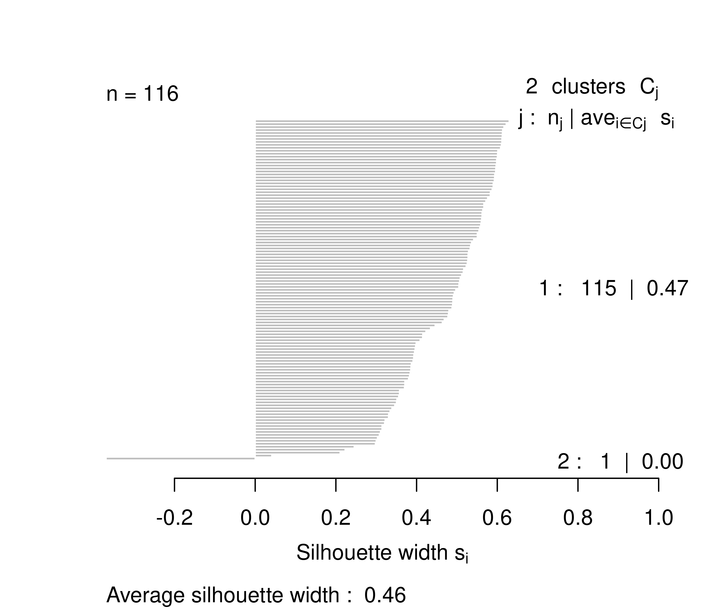

```{r setup, include=FALSE}
knitr::opts_chunk$set(echo = FALSE)
knitr::opts_knit$set(root.dir = normalizePath(".."))
options(scipen = 999)
library(pander)
library(knitr)
library(philsfmisc)
panderOptions('table.style', 'rmarkdown')
panderOptions('table.split.table', 160)
```

---

**[title]**

**Histórico do documento**

```{r history}
Version <- c("01")
Changes <- c("Versão inicial")
history <- cbind(Version, Changes)
colnames(history) <- c("Versão", "Alterações")
# pander(history, split.cells = 70)
kable(history)
```

---

# Lista de abreviaturas

# Contexto

## Objetivos

## Recepção e tratamento dos dados

# Metodologia

```{r results, include=FALSE}
source("scripts/results.R", encoding = 'UTF-8')
```

## Variáveis

### Desfechos primário e secundário

### Covariáveis

## Análises Estatísticas

Esta análise foi realizada utilizando-se o software `R` versão `r getRversion()`.

# Resultados

## Espaço de hiperparâmetros

```{r fig1, fig.cap="**Figura 1** caption."}
# 
knitr::include_graphics("../figures/hiper.png", error = FALSE)
```

```{r tab1}
final_top %>%
  kable(
    row.names = TRUE,
    col.names = c(
      k = attr(final_top$k, "label"),
      dist = attr(final_top$dist, "label"),
      meth = attr(final_top$meth, "label"),
      sil = attr(final_top$sil, "label")
      ),
    digits = 4,
    caption = "**Tabela 1** Combinações de hiperparâmetros com os dez maiores valores de silhueta média.  
    euclidian = Métrica Euclidiana (norma 2);
    centroid = Método de ligação centróide;
    maximum = Métrica do supremo (norma infinito);
    median = Método de ligação da mediana;
    minkowski_0.5 = Métrica de Minkowski (norma p), p = 0.5;
    single = Método de ligação single (distância mínima);
    ward.D = Método de ligação de Ward (sem critério de Ward 1963);
    ward.D2 = Método de ligação de Ward (com critério de Ward 1963)."
  )
```


## Silhuetas das soluções ótimas

```{r fig2, fig.cap="**Figura 2** caption."}
# 
knitr::include_graphics("../figures/sil_final.png", error = FALSE)
```

```{r fig3, fig.cap="**Figura 3** caption."}
# 
knitr::include_graphics("../figures/sil_rej.png", error = FALSE)
```

# Observações e limitações

# Conclusões

# Referências

- **SAP-2021-017-JG-v01** -- Plano Analítico para [title]

# Apêndice

## Análise exploratória de dados

```{r A1, fig.cap="**Figura A1** Distribuição da idade na população do estudo."}
# 
# knitr::include_graphics("../figures/distr_age.png", error = FALSE)
```

## Disponibilidade

Tanto este documento como o plano analítico correspondente (**SAP-2021-017-JG-v01**) podem ser obtidos no seguinte endereço:

<!-- Este documento pode ser obtido no seguinte endereço: -->

<https://philsf-biostat.github.io/SAR-2021-017-JG/>

## Dados utilizados

Os dados utilizados neste relatório não podem ser publicados online por questões de sigilo.

```{r data}
# print analytical of analytical_mockup whether it is the private or public version of the SAR

# analytical %>%
#   pander(caption = "**Tabela A1** Tabela de dados analíticos")
analytical_mockup %>%
  pander(caption = "**Tabela A1** Estrutura da tabela de dados analíticos")
```
