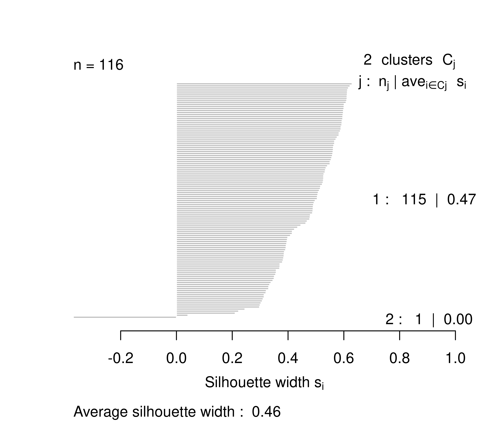

---

**[title]**

**Histórico do documento**

|Versão |Alterações     |
|:------|:--------------|
|01     |Versão inicial |

---

# Lista de abreviaturas

# Contexto

## Objetivos

## Recepção e tratamento dos dados

# Metodologia

## Variáveis

### Desfechos primário e secundário

### Covariáveis

## Análises Estatísticas

Esta análise foi realizada utilizando-se o software `R` versão 4.1.1.

# Resultados

## Espaço de hiperparâmetros

**Figura 1** caption.

Table: **Tabela 1** caption.  
    caption.

|  k|Métrica (distância) |Método de ligação | Silhueta média|
|--:|:-------------------|:-----------------|--------------:|
|  2|maximum             |single            |           0.46|
|  2|maximum             |median            |           0.46|
|  2|maximum             |centroid          |           0.46|
| 10|minkowski_0.5       |ward.D            |           0.42|
| 10|minkowski_0.5       |ward.D2           |           0.42|
|  2|minkowski_0.5       |single            |           0.42|
|  9|minkowski_0.5       |ward.D            |           0.42|
|  9|minkowski_0.5       |ward.D2           |           0.42|
|  2|euclidian           |centroid          |           0.41|
|  8|minkowski_0.5       |ward.D            |           0.40|
|  8|minkowski_0.5       |ward.D2           |           0.40|

## Silhuetas das soluções ótimas

**Figura 2** caption.

**Figura 3** caption.

# Observações e limitações

# Conclusões

# Referências

- **SAP-2021-017-JG-v01** -- Plano Analítico para [title]

# Apêndice

## Análise exploratória de dados

## Disponibilidade

Tanto este documento como o plano analítico correspondente (**SAP-2021-017-JG-v01**) podem ser obtidos no seguinte endereço:

<!-- Este documento pode ser obtido no seguinte endereço: -->

<https://philsf-biostat.github.io/SAR-2021-017-JG/>

## Dados utilizados

Os dados utilizados neste relatório não podem ser publicados online por questões de sigilo.

| id  | corp_pentecostal | receita_agp | receita_outras | num_votos | capilaridade | posicao | decil_filiados | decil_deputados |
|:---:|:----------------:|:-----------:|:--------------:|:---------:|:------------:|:-------:|:--------------:|:---------------:|
|  1  |                  |             |                |           |              |         |                |                 |
|  2  |                  |             |                |           |              |         |                |                 |
|  3  |                  |             |                |           |              |         |                |                 |
| ... |                  |             |                |           |              |         |                |                 |
| 116 |                  |             |                |           |              |         |                |                 |

Table: **Tabela A1** Estrutura da tabela de dados analíticos
