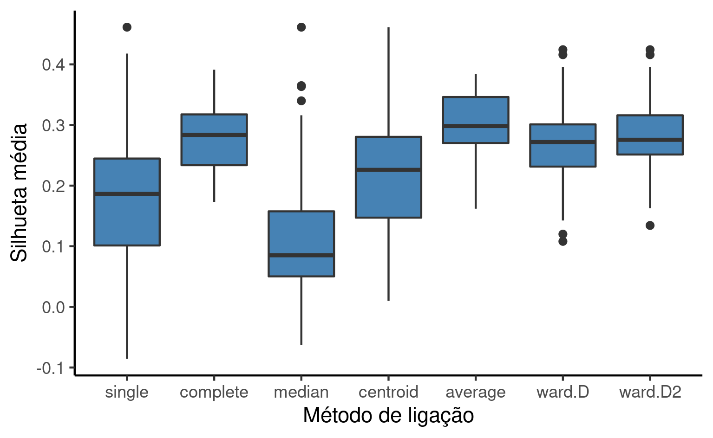
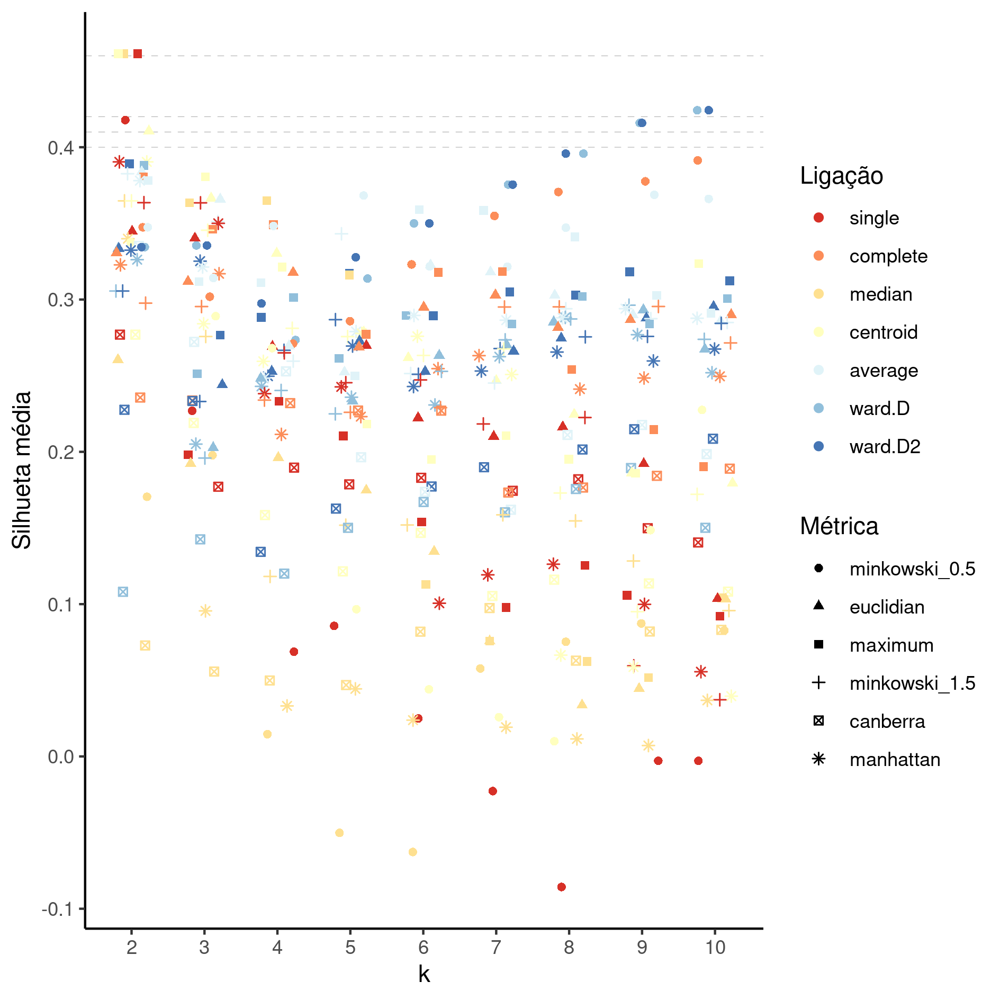

---

**Otimização de hiperparâmetros de clusterização hierárquica para identificação de deputados evangélicos de corporações pentecostais eleitos em 2018**

**Histórico do documento**

|Versão |Alterações     |
|:------|:--------------|
|01     |Versão inicial |

---

# Lista de abreviaturas

# Contexto

## Objetivos

## Recepção e tratamento dos dados

# Metodologia

## Variáveis

### Desfechos primário e secundário

### Covariáveis

## Análises Estatísticas

Esta análise foi realizada utilizando-se o software `R` versão 4.1.1.

# Resultados

## Espaço de hiperparâmetros

Ao todo foram incluídas 378 combinações dos três hiperparâmetros, com suas respectivas clusterizações hierárquicas geradas e silhuetas médias calculadas.

A fim de facilitar o uso dos resultados desta análise, foi escolhido descrever os conjuntos de parâmetros de acordo com os argumentos das funções da linguagem R.
Desta forma, a escolha de hiperparâmetros baseada nas análises de silhueta média podem ser diretamente aplicados na implementação.
Os detalhes dos argumentos a seguir podem ser vistos na documentação das funções `dist` e `hclust`, do R base (pacote `stats`).

As métricas de distância descritas nesta seção são:

- **canberra**: Métrica de Canberra;
- **euclidian**: Métrica Euclidiana (norma 2);
- **manhattan**: Métrica de Manhattan (norma 1);
- **maximum**: Métrica do supremo (norma infinito);
- **minkowski_0.5**: Métrica de Minkowski (norma p), p = 0.5;
- **minkowski_1.5**: Métrica de Minkowski (norma p), p = 1.5.

Os métodos de ligação descritos nesta seção são:

- **average**: Método de ligação média (distância média);
- **centroid**: Método de ligação centróide;
- **complete**: Método de ligação completa (distância máxima);
- **median**: Método de ligação da mediana;
- **single**: Método de ligação single (distância mínima);
- **ward.D**: Método de ligação de Ward (sem critério de Ward 1963);
- **ward.D2**: Método de ligação de Ward (com critério de Ward 1963).

Como a visualização de um espaço com quatro dimensões é desafiadora, vamos inicialmente considerar as projeções em espaços bidimensionais e avaliar a variabilidade de performance mensurado pelas silhuetas médias em cada hiperparâmetro.

Trocando as métricas de distância (Figura 1) a melhor performance foi obtida pela métrica maximum, com silhueta média 0.461, seguida da métrica de Minkowski com p = 0.5 (silhueta média 0.424).
As métricas de Minkowski com p = 1.5 e Canberra tiveram a pior performance geral com as maiores silhuetas médias atingindo 0.383 e 0.335, respectivamente.
As menores silhuetas médias foram observadas na métrica de Minkowski com p = 0.5 e Manhanttan (silhueta média -0.0857 e 0.00716, respectivamente).

**Figura 1** Distribuição da idade na população do estudo.

Trocando os métodos de ligação (Figura 2) o maior valor de silhueta foi observado simultaneamente em três métodos: centroide, mediana e single com silhueta média 0.461.
O segundo maior valor observado foi outro empate, desta vez entre os métodos ward.D e ward.D2 (0.424).
Os dois menores valores de silhueta foram observados com o método single (-0.0857) e mediana (-0.0628).

**Figura 2** Distribuição da idade na população do estudo.

Trocando o número k de clusters (Figura 3) o maior valor de silhueta média foi observado com k = 2 (0.461), seguido de k = 10 (0.424) e k = 9 (0.416).
Os valores mais baixos de silhueta observados foram -0.0857 para k=8 e -0.0628 para k=6.

**Figura 3** Distribuição da idade na população do estudo.

No geral, as silhuetas médias observadas variaram entre -0.0857 e 0.461.
A Tabela 1 mostra os dez maiores valores de silhueta, e as combinações de hiperparâmetros que os geraram.
A Figura 4 mostra todas as 378 combinações de hiperparâmetros avaliadas.
Foi necessário acrescentar um pequeno jitter horizontal para permitir a visualização de pontos sobrepostos, e a paleta de cores foi organizada para desenfatizar os métodos de ligação que não serão recomendados na aplicação dos resultados desta análise (centroide e mediana).
A listagem completa de valores de silhueta média podem ser consultados [neste link](https://github.com/philsf-biostat/SAR-2021-017-JG/blob/main/figures/sil.csv).

Table: **Tabela 1** Combinações de hiperparâmetros com os dez maiores valores de silhueta média.

|   |  k|Métrica (distância) |Método de ligação | Silhueta média|
|:--|--:|:-------------------|:-----------------|--------------:|
|1  |  2|maximum             |single            |         0.4614|
|2  |  2|maximum             |median            |         0.4614|
|3  |  2|maximum             |centroid          |         0.4614|
|4  | 10|minkowski_0.5       |ward.D            |         0.4243|
|5  | 10|minkowski_0.5       |ward.D2           |         0.4243|
|6  |  2|minkowski_0.5       |single            |         0.4178|
|7  |  9|minkowski_0.5       |ward.D            |         0.4159|
|8  |  9|minkowski_0.5       |ward.D2           |         0.4159|
|9  |  2|euclidian           |centroid          |         0.4107|
|10 |  8|minkowski_0.5       |ward.D            |         0.3958|
|11 |  8|minkowski_0.5       |ward.D2           |         0.3958|

**Figura 4** Silhuetas médias das combinações de hiperparâmetros avaliadas. Linhas tracejadas indicam os dez maiores valores de silhueta média observados.

## Silhuetas das soluções ótimas

De acordo com os critérios de exclusão especificados no plano analítico (**SAP-2021-017-JG-v01**) os métodos de ligação da mediana e do centroide não são recomendados pois podem gerar inversões nas clusterizações hierárquicas.

Além disto, observa-se que o método de ligação ward.D era usado historicamente em versões anteriores da linguagem R e a documentação indica que o método ward.D2 é sugerido na literatura específica, além de ser a única opção em outra implementação (na função `agnes` do pacote `cluster`).
Por estes motivos, em caso de empate entre as duas versões do método de Ward, será recomendado aqui o uso do ward.D2.

O maior valor de silhueta foi observado com três conjuntos de hiperparâmetros.
Duas destas combinações incluem métodos excluídos da avaliação (mediana e centróide).
O terceiro conjunto é composto pela métrica "maximum", o método de ligação "single" e k=2.
Esta combinação de hiperparâmetros gera uma clusterização hierárquica com silhueta média 0.4614 (Figura 5).
As silhuetas médias de cada cluster são, respectivamente 0.47 e 0.
Este conjunto de hiperparâmetros gerou um cluster com um deputado, e como este resultado não atende ao objetivo estabelecido, esta combinação de hiperparâmetros foi rejeitada.

**Figura 5** caption.

O segundo maior valor de silhueta média (0.4243) foi observado com dois conjuntos de hiperparâmetros.
Ambas as combinações usaram a métrica de Minkowski com p=0.5, e k=10, diferindo apenas pelo método de ligação: um com ward.D e a outra com ward.D2.
Optando assim pelo método de ligação ward.D2 vemos as silhuetas da clusterização hierárquica gerada com este conjunto de hiperparâmetros na figura 6.
Os tamanhos dos clusters gerados variaram entre 3 e 33 observações.
As silhuetas médias dos clusters variaram entre 0.1526 e 0.7376.
As silhuetas das observações individuais variaram entre -0.2507 e 0.8139.

**Figura 6** caption.

# Observações e limitações

# Conclusões

# Referências

- **SAP-2021-017-JG-v01** -- Plano Analítico para Otimização de hiperparâmetros de clusterização hierárquica para identificação de deputados evangélicos de corporações pentecostais eleitos em 2018

# Apêndice

## Análise exploratória de dados

## Disponibilidade

Tanto este documento como o plano analítico correspondente (**SAP-2021-017-JG-v01**) podem ser obtidos no seguinte endereço:

<!-- Este documento pode ser obtido no seguinte endereço: -->

<https://philsf-biostat.github.io/SAR-2021-017-JG/>

## Dados utilizados

Os dados utilizados neste relatório não podem ser publicados online por questões de sigilo.

| id  | corp_pentecostal | receita_agp | receita_outras | num_votos | capilaridade | posicao | decil_filiados | decil_deputados |
|:---:|:----------------:|:-----------:|:--------------:|:---------:|:------------:|:-------:|:--------------:|:---------------:|
|  1  |                  |             |                |           |              |         |                |                 |
|  2  |                  |             |                |           |              |         |                |                 |
|  3  |                  |             |                |           |              |         |                |                 |
| ... |                  |             |                |           |              |         |                |                 |
| 116 |                  |             |                |           |              |         |                |                 |

Table: **Tabela A1** Estrutura da tabela de dados analíticos
